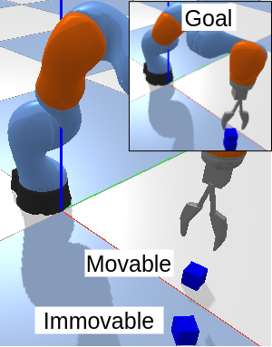
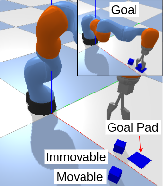
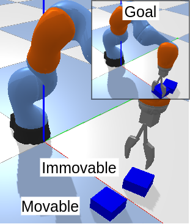
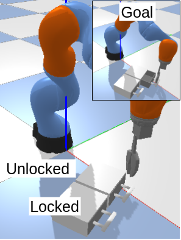

```
# Equivariant Reinforcement Learning under Partial Observability
```
---
## Contents

[Website](https://sites.google.com/view/equi-rl-pomdp) and [Paper](https://openreview.net/forum?id=AnDDMQgM7-)

[Setup](#setup)

[Domains](#domain)

[Train](#train)

[License, Acknowledgments](#license)

---

## Setup
1. Install [anaconda](https://docs.conda.io/projects/conda/en/latest/user-guide/install/)
2. Create and activate environment
```
conda create --env equi_pomdps python=3.8.16
conda activate equi_pomdps
```
3. Clone this repository and install required packages
```
git clone https://github.com/hai-h-nguyen/equi-rl-for-pomdps.git
pip install -r requirements.txt
```
4. Install [Pytorch](https://pytorch.org/get-started/previous-versions/) (I used 1.12.0 for cuda 10.2 but other versions should work)
```
conda install pytorch==1.12.0 torchvision==0.13.0 torchaudio==0.12.0 cudatoolkit=10.2 -c pytorch
```
5. Install submodules
```
cd escnn
pip install -r requirements.txt
pip install -e .
cd ..
cd pomdp_robot_domains
pip install -r requirements.txt
pip install -e .
cd ..
cd pomdp-domains
pip install -e .
cd ..
```

---

## Train

### Domains: Block-Picking, Block-Pulling, Block-Pushing, Drawer-Opening
   
### Before Training
```export PYTHONPATH=${PWD}:$PYTHONPATH```

### Training

```
python3 policies/main.py --cfg configs/block_pulling/rnn.yml --algo sac --seed 0 --cuda 0 --time_limit 1000 --num_expert_episodes 80
python3 policies/main.py --cfg configs/block_pulling/rnn-equi-all.yml --algo sac --seed 0 --cuda 0 --time_limit 1000 --num_expert_episodes 80

```

## Simulate a Trained Policy
```
python3 policies/main.py --cfg configs/block_pulling/rnn-equi-all.yml --algo sac --seed 0 --cuda 0 --time_limit 1000 --num_expert_episodes 80 --replay --policy_dir saved_policies/agent_block_pulling.pt
```

---

## License

This code is released under the MIT License.

---

## Acknowledgments

This codebase evolved from the [pomdp-baselines](https://github.com/twni2016/pomdp-baselines).
